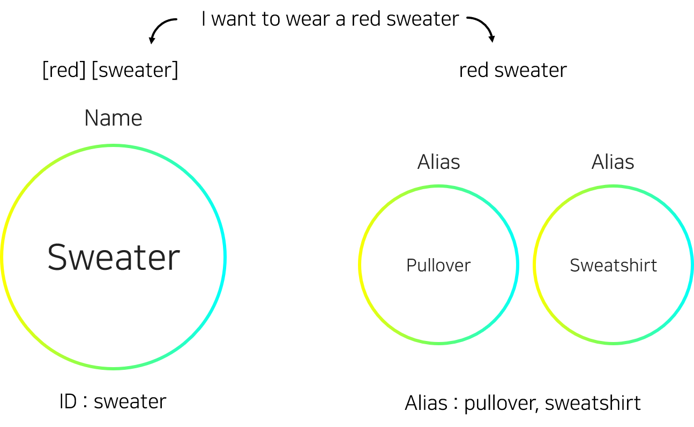

## HandEl

##### Mode easily handle the elasticsearch module

for installing and using, requirements are below : 

* tqdm : https://github.com/tqdm/tqdm

* elasticsearch : https://github.com/elastic/elasticsearch-py

***

### Installation

```code
pip3 install handEl-master/
```

***

### Projects

handEl mechanisms are introduce in below.



Before we started, if you don't know about elasticsearch,

please study from here : https://www.elastic.co/guide/en/elasticsearch/reference/current/index.html

handEl has several useful functions.

* indexing : Change the index for doing utilies.

* search : Search the document from fields by text or texts.

* tokenize : Using ES analyzer. (you need to make the analyzer for that)

* doc : Search the document from id by text or texts.

* num : Get number of results.

* prope : Create documents from dictionaries.

***

### Examples

* Script
```python3
from handEl import handEl
from pprint import pprint as pp

if __name__ == "__main__" :
    HOST = 'localhost'
    PORT = 8080

    INDEX = "test_index"
    DATA1 = {'alias':['hello', '메롱']}
    DATA2 = {'alias':['world', '메렁']}

    he = handEl(host=HOST, port=PORT)
    # Index from the ES
    he.indexing(INDEX)   

    # Add documents
    he.prope('A0', DATA1, True)
    he.prope("A1", DATA2, False)
    he.doc('A0')
    pp(he.result)
    
    he.search("메롱 좀 하지마!")
    pp(he.result)
    he.search("그럼 메렁 해야지~")
    pp(he.result)

    print(he.tokenize("i might love with you."))
```
* Outputs
```python
Elasticsearch Connection Success [localhost:8080]
{'alias': ['world', '메렁']}
{'match_ids': ['A0'],
 'match_num': 1,
 'match_res': {'alias': ['hello', '메롱']},
 'match_sco': 1}
{'match_ids': ['A0'],
 'match_num': 1,
 'match_res': [{'alias': ['hello', '메롱']}],
 'match_sco': 0.9808291}
{'match_ids': ['A1'],
 'match_num': 1,
 'match_res': [{'alias': ['메렁', 'world']}],
 'match_sco': 0.4700036}
['might', 'love']
```

***


### Notices

###### Unauthorized distribution and commercial use are strictly prohibited without the permission of the original author and the related module.